# LumioUP

[](https://github.com/GabrielFSantana/LumioUP/actions/workflows/ci.yml)

**Acenda a luz do seu controle financeiro.** O LumioUP é um aplicativo de finanças pessoais para celular que
transforma organizar o dinheiro em um hábito leve: você registra seus lançamentos, entende para onde o dinheiro vai,
aprende com conteúdos curtos e evolui com XP, missões e conquistas, sozinho ou com amigos, **sem nunca expor valores
em reais**.

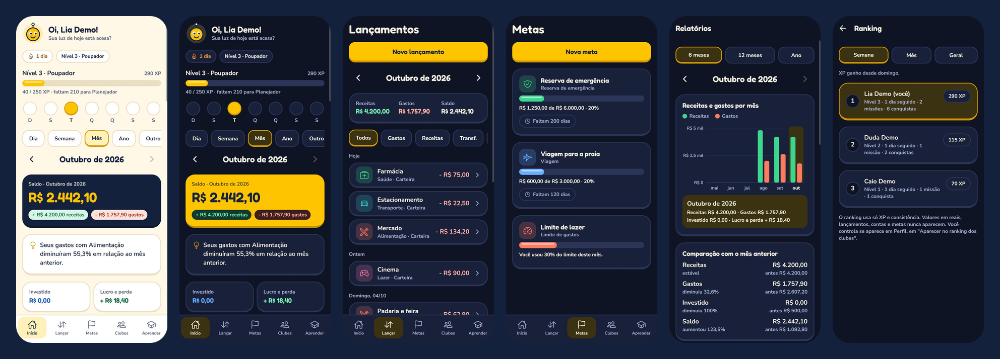

> As capturas são da **versão web** do app em tamanho de celular, com dados fictícios de uma conta de demonstração.
> No Android o app foi validado em um aparelho (POCO X4 GT); iOS ainda não foi testado.

## Princípios

- **Entrada manual, sem integração bancária.** Você decide o que registrar. Nada de senhas de banco.
- **Privacidade primeiro.** Os clubes não têm nenhuma coluna financeira: os outros membros veem apenas nome e, se você
  permitir, nível, XP e sequência. Desafios e rankings mostram só ações e porcentagens.
- **Gamificação que premia constância, não renda.** O XP é concedido no servidor, uma vez por ação, com limites diários.
- **Linguagem neutra e sem culpa.** Conteúdo educativo, sem recomendação de investimentos.
- **Dinheiro em centavos inteiros**, sem erros de arredondamento.

## O que o app faz

| Área                    | O que você encontra                                                                                                                                            |
| ----------------------- | -------------------------------------------------------------------------------------------------------------------------------------------------------------- |
| **Início**              | Saldo e patrimônio por dia, semana, mês, ano ou período livre; receitas, gastos, investido e lucro/perda; insights em linguagem neutra; nível, XP e sequência. |
| **Lançamentos**         | Gasto, receita, transferência e investimento em poucos toques; filtros; excluir com desfazer; contas e categorias editáveis.                                   |
| **Investimentos**       | Posições, aportes, resgates, lucro e perda.                                                                                                                    |
| **Metas**               | Metas acumulativas (reserva de emergência, viagem...) com contribuições e prazo, e metas mensais (investir, limite de gastos) calculadas pelos lançamentos.    |
| **Relatórios**          | Gráficos próprios em SVG: receitas e gastos mês a mês, comparação com o mês anterior, categorias que mais cresceram.                                           |
| **Gamificação**         | XP e níveis, sequência de dias, missões diárias e semanais, conquistas, comemoração de nível.                                                                  |
| **Clubes**              | Criar clube, entrar por código ou link, papéis (dono, admin, membro), privacidade escolhida por você.                                                          |
| **Desafios e ranking**  | Desafios coletivos por ação (dias organizados, lançamentos, contribuições) com placar em %; ranking por XP da semana, do mês ou geral.                         |
| **Aprender**            | Trilha "Primeiros passos" com 8 artigos curtos, glossário, quiz com correção no servidor e sugestões de leitura a partir dos seus registros.                   |
| **Notificações**        | Lembretes locais e opcionais (registrar, missões, revisão semanal, metas, resumo do mês), todos desligados por padrão.                                         |
| **Privacidade e dados** | Exportar tudo em JSON ou os lançamentos em CSV; excluir a conta de forma definitiva; histórico dos termos aceitos.                                             |

## Galeria

<table>
  <tr>
    <td align="center">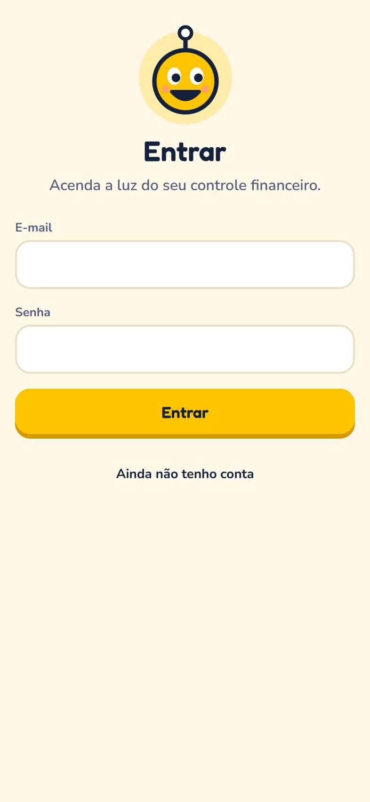<br><sub>Entrar</sub></td>
    <td align="center">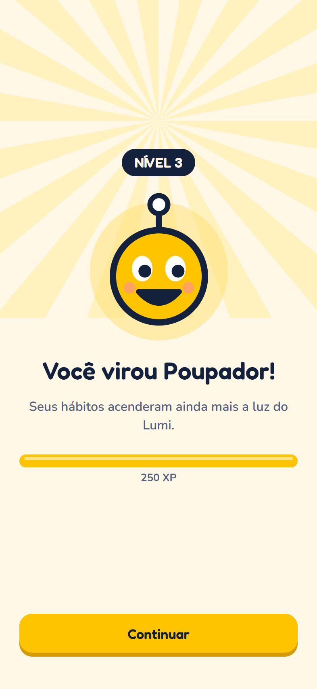<br><sub>Subida de nível</sub></td>
    <td align="center">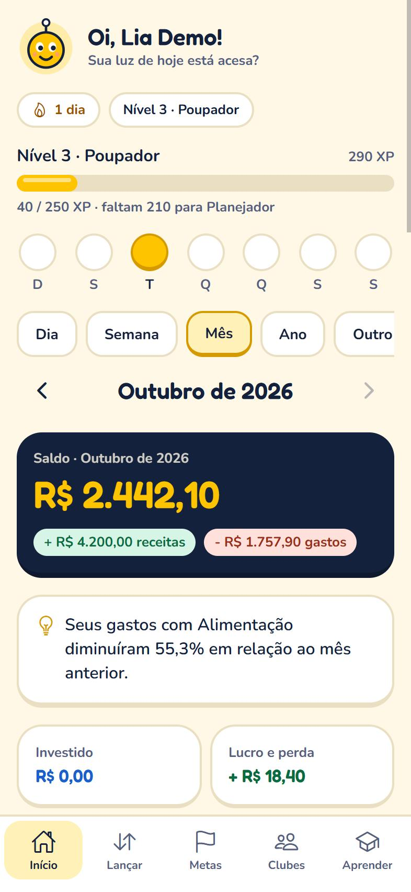<br><sub>Início (claro)</sub></td>
    <td align="center">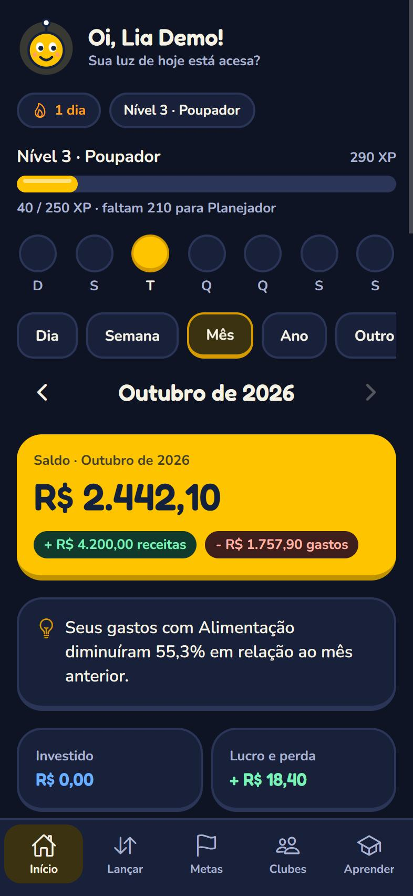<br><sub>Início (escuro)</sub></td>
  </tr>
  <tr>
    <td align="center">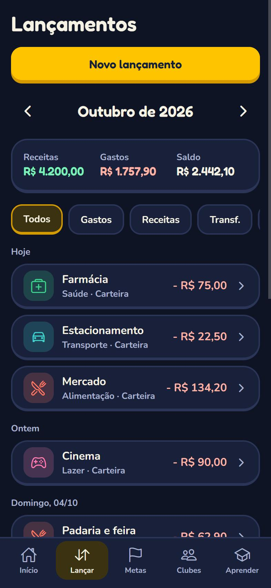<br><sub>Lançamentos</sub></td>
    <td align="center">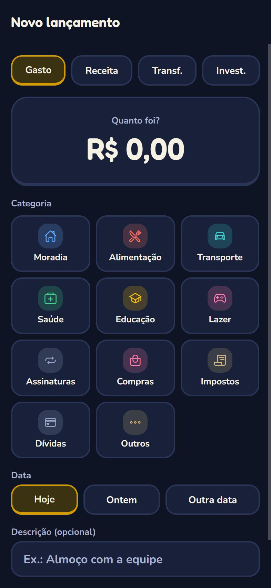<br><sub>Novo lançamento</sub></td>
    <td align="center">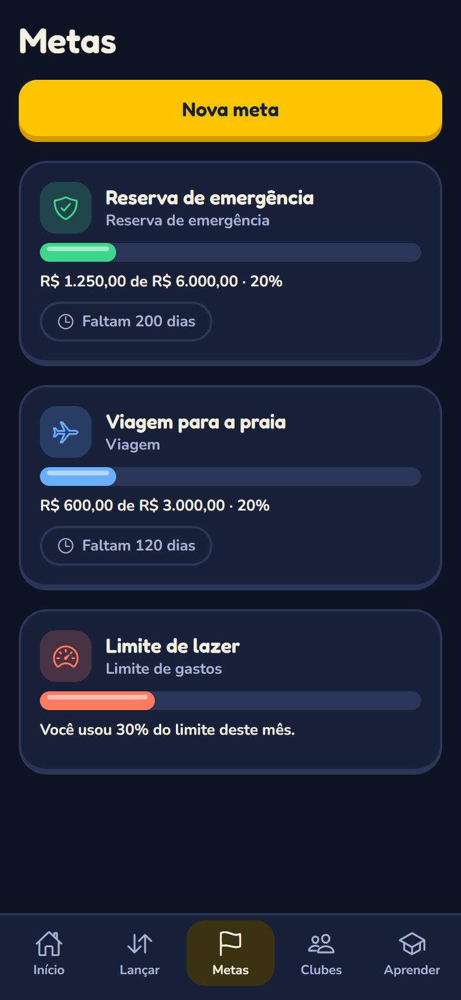<br><sub>Metas</sub></td>
    <td align="center">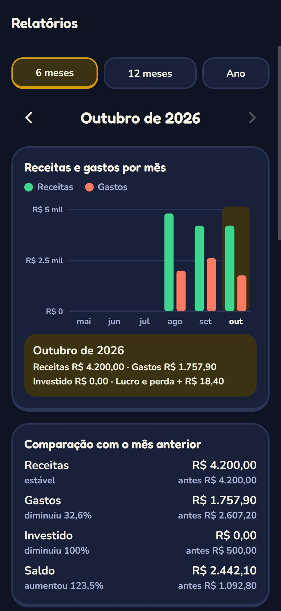<br><sub>Relatórios</sub></td>
  </tr>
  <tr>
    <td align="center">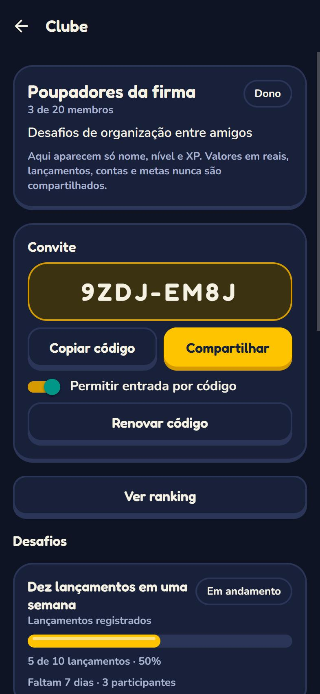<br><sub>Clube</sub></td>
    <td align="center"><br><sub>Ranking</sub></td>
    <td align="center">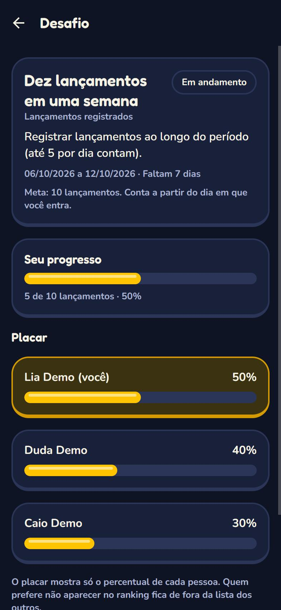<br><sub>Desafio</sub></td>
    <td align="center">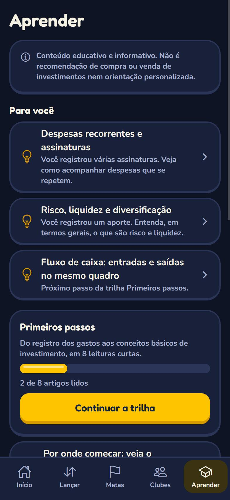<br><sub>Aprender</sub></td>
  </tr>
  <tr>
    <td align="center">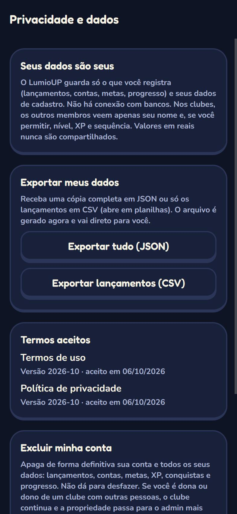<br><sub>Privacidade e dados</sub></td>
    <td></td>
    <td></td>
    <td></td>
  </tr>
</table>

## Como funciona por baixo

Monorepo com `npm workspaces`:

```
apps/mobile          App Expo (React Native + Expo Router), telas e hooks
packages/core        Regras puras em TypeScript: dinheiro em centavos, finanças, metas,
                     gamificação, clubes, desafios, educação, notificações, privacidade
packages/integration Teste de jornada completa contra o Supabase local
supabase/            Migrações SQL, políticas de segurança (RLS) e testes pgTAP
docs/                Decisões (ADRs), gamificação, privacidade/LGPD, publicação e identidade visual
tools/               Gerador dos ícones do app (a partir do mascote Lumi)
CLAUDE/              Briefing original e plano de arquitetura do projeto
```

**Stack:** Expo SDK 57, React Native, Expo Router, React Query, TypeScript, Supabase (Postgres, Auth e RLS),
Jest e pgTAP.

**Decisões que valem destacar**

- **A segurança mora no banco.** Toda tabela tem RLS; escrita sensível (XP, clubes, desafios, progresso) só por funções
  no servidor. Um teste transversal falha se alguém criar uma tabela sem RLS ou uma função aberta demais.
- **XP, missões e conquistas são calculados por gatilhos no servidor**, com chave de idempotência e limite diário.
  O app só lê.
- **Gráficos próprios em SVG**, sem biblioteca de gráficos ([ADR 0001](docs/decisions/0001-graficos-svg-proprios.md)).
- **Lembretes locais no celular**, sem servidor de envio e sem guardar tokens
  ([ADR 0002](docs/decisions/0002-notificacoes-locais.md)).

## Rodando localmente

**Pré-requisitos:** Node 22 ou superior e Docker Desktop (para o Supabase local).

```bash
npm install
npm run db:start          # sobe o Supabase local (Postgres + Auth) e aplica as migrações
```

Copie `.env.example` para `apps/mobile/.env` e preencha a chave `anon` com a que o `npx supabase status` mostrar:

```bash
cp .env.example apps/mobile/.env
```

```bash
cd apps/mobile
npx expo start            # use "w" para abrir no navegador
```

**No celular, com o Expo Go:** o celular precisa alcançar o seu computador. Troque `127.0.0.1` pelo IP do PC na rede
em `EXPO_PUBLIC_SUPABASE_URL`, libere as portas 8081 e 54321 no firewall e reinicie com `npx expo start -c`.

**Atalhos do banco:** `npm run db:test` (testes), `npm run db:reset` (recria tudo, apaga os usuários de teste) e
`npm run db:types` (regenera os tipos depois de uma migração).

## Testes

| O quê                           | Comando                              | Cobertura                                                                      |
| ------------------------------- | ------------------------------------ | ------------------------------------------------------------------------------ |
| Lint e tipos                    | `npm run lint` · `npm run typecheck` | todo o repositório                                                             |
| Unitários (core e tema do app)  | `npm test`                           | 382 testes: cálculos, regras de XP, clubes, desafios, contraste AA, desempenho |
| Banco: RLS, permissões e regras | `npm run db:test`                    | 423 asserções (pgTAP)                                                          |
| Jornada completa                | `npm run test:integration`           | 10 passos com dois usuários reais, do cadastro à exclusão da conta             |

O CI do GitHub roda tudo isso a cada envio (`.github/workflows/ci.yml`).

## Publicação

O app já gera APK de teste para Android pelo EAS (`apps/mobile/eas.json`, perfil `preview`) e usa um projeto Supabase
próprio na nuvem. O passo a passo, o que depende de contas suas e **o que ainda não foi testado** estão em
[docs/publicacao.md](docs/publicacao.md).

## Documentação

- [Arquitetura e plano do projeto](CLAUDE/ARQUITETURA_LUMIOUP.md)
- [Gamificação: XP, missões, conquistas, desafios e educação](docs/gamificacao.md)
- [Privacidade e LGPD](docs/privacidade-lgpd.md)
- [Qualidade e publicação](docs/publicacao.md)
- [Identidade visual (protótipo)](docs/identidade-visual/mockup.html)

## Identidade visual

Estilo claro, moderno e gamificado, com botões "gordinhos" de base sólida, sem sombras difusas, e o mascote **Lumi**.

| Cor   | Hex       | Uso                        |
| ----- | --------- | -------------------------- |
| Luz   | `#FFC400` | Ação principal e progresso |
| Tinta | `#14213D` | Texto e fundos escuros     |
| Papel | `#FFF8E7` | Fundo do modo claro        |
| Mata  | `#17A865` | Receitas                   |
| Brasa | `#E5533B` | Gastos                     |
| Céu   | `#2D7DF6` | Investimentos              |
| Lagoa | `#0E9E99` | Metas                      |

O contraste de texto (WCAG AA) é verificado automaticamente nos dois modos.

## Situação e limitações

- Roteiro de 18 etapas concluído (fundação, finanças, gamificação, clubes, educação, notificações, privacidade e
  publicação).
- **Ainda não validado em aparelho:** notificações reais, compartilhamento de arquivo, leitor de tela (TalkBack e
  VoiceOver) e iOS.
- **Pendências para abrir ao público:** revisão jurídica dos termos e da política de privacidade, bloqueio por
  biometria e avisos remotos (push) de atividades do clube.
- O conteúdo educativo é informativo e não constitui recomendação de investimento.

## Autor

Feito por [Gabriel (GabrielFSantana)](https://github.com/GabrielFSantana). Licença ainda não definida.
